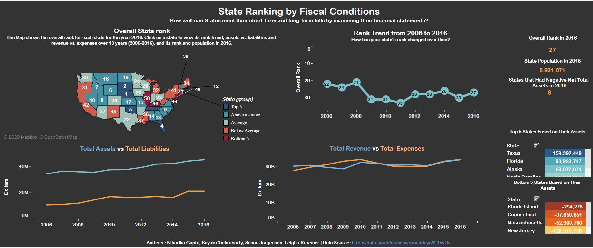

# US States Fiscal Ranking - (Tableau)

#### Tableau Public Profile : https://public.tableau.com/profile/sayakc027#!/vizhome/USAStateFiscalRankings/FiscalConditionsofUSA

## Objective:
How well can States meet their short-term and long-term bills by examining their financial statements?

## Insights:
* Overall State Rank
* Rank Trend of each state over the scope of 10 years
* Total Assets vs Total Liabilities for each state over the period of 10 years
* Total Revenue vs Total Expense for each state over the period of 10 years
* Top 5 and Bottom 5 states based on their latest over all assets

## Dashboard:

